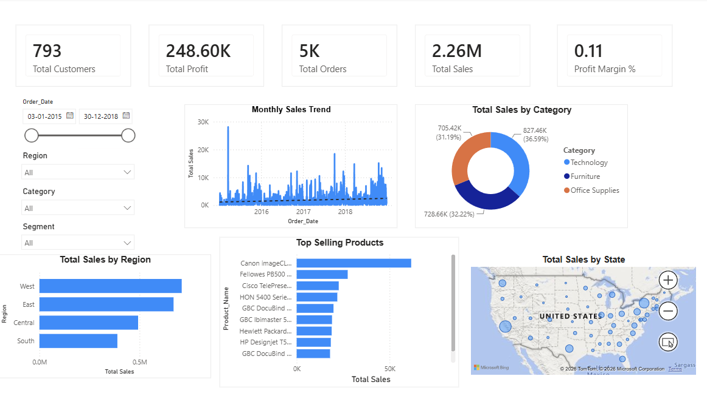
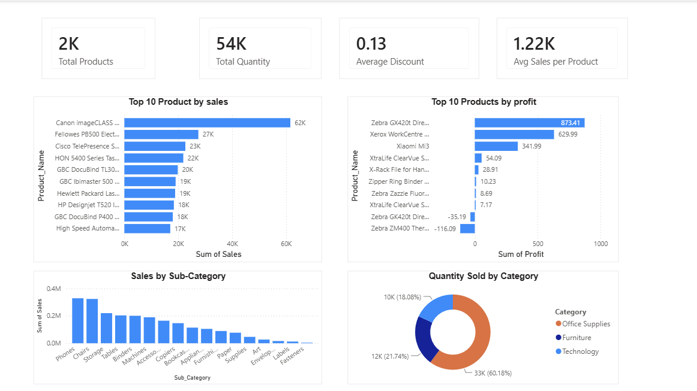
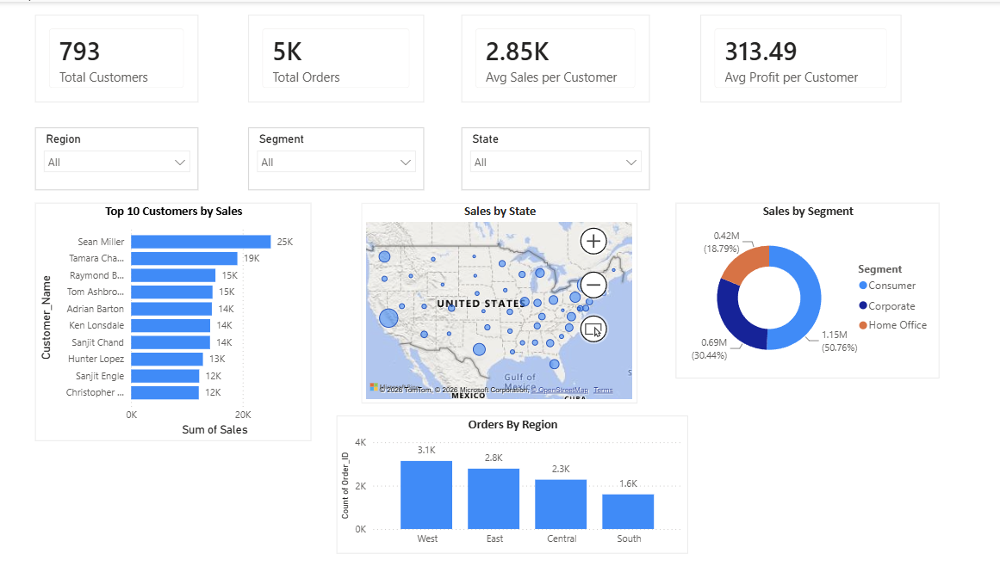

# 📊 Sales & Business Performance Analysis

## 📌 Project Overview

This project is an end-to-end Business Intelligence solution built using **SQL Server** and **Power BI**. It analyzes retail sales data to uncover insights into sales performance, product performance, customer behavior, and regional trends through interactive dashboards.

---

## 🛠️ Tools & Technologies

- Microsoft Excel
- SQL Server
- Power BI
- DAX (Data Analysis Expressions)
- GitHub

---

## 📂 Project Structure

```
Sales-Business-Performance-Analysis
│
├── Dataset
├── SQL
├── PowerBI
├── Images
└── README.md
```

---

## 📈 Dashboard Pages

### 1️⃣ Executive Dashboard

- Total Sales
- Total Profit
- Total Orders
- Total Customers
- Profit Margin
- Monthly Sales Trend
- Sales by Category
- Sales by Region

### 2️⃣ Product Performance

- Top 10 Products by Sales
- Top 10 Products by Profit
- Sales by Sub-Category
- Quantity by Category

### 3️⃣ Customer & Regional Insights

- Top 10 Customers
- Sales by Segment
- Sales by State
- Orders by Region

---

## 🗃️ SQL Concepts Used

- Aggregate Functions
- GROUP BY
- ORDER BY
- Date Functions
- Business KPI Analysis

---

## 📷 Dashboard Preview

### Executive Dashboard



### Product Performance



### Customer & Regional Insights



---

## 🚀 Key Insights

- Identified the highest-performing products and categories.
- Compared regional sales performance.
- Analyzed customer purchasing behavior.
- Built interactive dashboards with KPIs and slicers.
- Enabled business decision-making through data visualization.

---

## 👨‍💻 Author

**Abhay Sharma**
